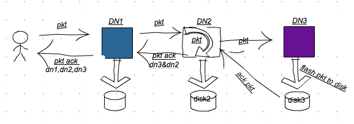
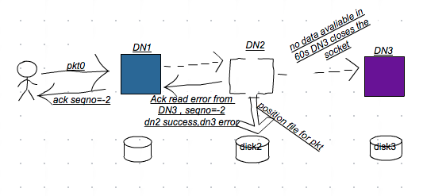
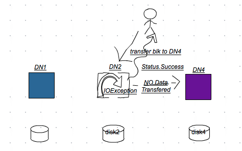
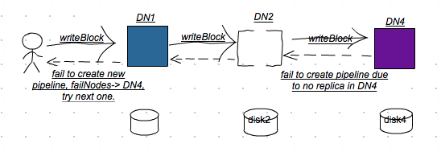
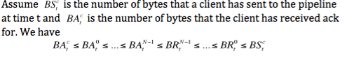

在我们的Hbase集群中，有时存在有些_RegionServer_ 因为不能继续往_HDFS_ 中写入**WAL**数据而导致异常退出，相应的异常如下：
<pre>
2016-08-06 03:45:42,547 FATAL [regionserver/c1-hd-dn18.bdp.idc/10.130.1.37:16020.logRoller] regionserver.HRegionServer: ABORTING region server c1-hd-dn18.bdp.idc,16020,1469772903345: Failed log close in log roller
org.apache.hadoop.hbase.regionserver.wal.FailedLogCloseException: hdfs://ns1/hbase/WALs/c1-hd-dn18.bdp.idc,16020,1469772903345/c1-hd-dn18.bdp.idc%2C16020%2C1469772903345.default.1470426151350, unflushedEntries=61
        at org.apache.hadoop.hbase.regionserver.wal.FSHLog.replaceWriter(FSHLog.java:988)
        at org.apache.hadoop.hbase.regionserver.wal.FSHLog.rollWriter(FSHLog.java:721)
        at org.apache.hadoop.hbase.regionserver.LogRoller.run(LogRoller.java:137)
        at java.lang.Thread.run(Thread.java:745)
</pre>
产生这个FATAL之前，大量的 _"java.io.IOException:Failed to replace a bad datanode on the existing pipeline due to no more good datanodes being available to try."_ 记录在其日志文件中。 从该异常抛出的message来分析， 则意味着在 _RegionServer_ 输出这样异常的那刻起， 在_HDFS_集群范围内找不到一例可用的DataNode来加入到当前的_Stream Pipeline_ 中。 然而事实上，我们当时的_HDFS_还在正常提供着数据的增删改查功能，并非没有正常的_DataNode_可用。

继续分析_RegionServer_的日志，在无可用_DataNode_之前，_RegionServer_会不断尝试与新的_DataNode_重建Stream Pipeline，毫无例外， 这样的尝试都失败了：
<pre>
2016-08-06 03:44:29,320 INFO  [DataStreamer for file /hbase/WALs/c1-hd-dn18.bdp.idc,16020,1469772903345/c1-hd-dn18.bdp.idc%2C16020%2C1469772903345.default.1470426151350 block BP-360285305-10.130.1.11-1444619256876:blk_1124743217_51010856] hdfs.DFSClient: Exception in createBlockOutputStream
java.io.IOException: Got error, status message , ack with firstBadLink as 10.130.a.b:50010
        at org.apache.hadoop.hdfs.protocol.datatransfer.DataTransferProtoUtil.checkBlockOpStatus(DataTransferProtoUtil.java:140)
        at org.apache.hadoop.hdfs.DFSOutputStream$DataStreamer.createBlockOutputStream(DFSOutputStream.java:1334)
        at org.apache.hadoop.hdfs.DFSOutputStream$DataStreamer.(DFSOutputStream.java:1159)
        at org.apache.hadoop.hdfs.DFSOutputStream$DataStreamer.processDatanodeError(DFSOutputStream.java:876)
        at org.apache.hadoop.hdfs.DFSOutputStream$DataStreamer.run(DFSOutputStream.java:402)
2016-08-06 03:44:29,321 WARN  [DataStreamer for file /hbase/WALs/c1-hd-dn18.bdp.idc,16020,1469772903345/c1-hd-dn18.bdp.idc%2C16020%2C1469772903345.default.1470426151350 block BP-360285305-10.130.1.11-1444619256876:blk_1124743217_51010856] hdfs.DFSClient: Error Recovery for block BP-360285305-10.130.1.11-1444619256876:blk_1124743217_51010856 in pipeline DatanodeInfoWithStorage[10.130.x.x:50010,DS-b2197bf5-f129-44df-b569-3ba0e51772c4,DISK], DatanodeInfoWithStorage[10.130.x.x:50010,DS-b0dc4a29-30fe-4633-a292-79274279e345,DISK], DatanodeInfoWithStorage[10.130.a.b:50010,DS-abe5559f-f706-4309-983b-08dd30bcdca4,DISK]: bad datanode DatanodeInfoWithStorage[10.130.a.b:50010,DS-abe5559f-f706-4309-983b-08dd30bcdca4,DISK]
</pre>

_RegionServer(DFSClient)_ 将_Bad DataNode_加入到一个不可用的队列**failed**中， 在向_NameNode_ 请求一个新的DataNode：

```
  createBlockOutputStream:
     while(pipeline创建没有成功 && pipeline没有被关闭 && dfsclient在被使用） ｛
       //1, 如果有DataNode在写或者创建pipeline时出现问题，将出错的DataNode加入到不可用的队列中
       failed.add(nodes[errorIndex]);
       //2, 将有问题的DataNode从当前的pipeline中移除
       //3, 是否需要往pipeline中添加新的DataNode节点
       if(符合datanode的替换策略）｛
          addDatanode2ExistingPipeline
       ｝
       //4, 生成新的generation stamp用以区分不同blk的不同版本
       //5, 创建pipeline输入输出流
     ｝
   
   addDatanode2ExistingPipeline:
      //get a new datanode
      final DatanodeInfo[] original = nodes;
      //nodes -> 目前pipeline上包含的DataNode节点
      //failed -> 缓存不可用的DataNode的列表
      //向NameNode请求新的DataNode
      final LocatedBlock lb = dfsClient.namenode.getAdditionalDatanode(
          src, fileId, block, nodes, storageIDs,
          failed.toArray(new DatanodeInfo[failed.size()]),
          1, dfsClient.clientName);
      setPipeline(lb);
```


在新pipeline中添加的DataNode节点日志文件中，发现当写入这个块时，由于该节点并没有相应的replica，而不能执行append的操作。该DataNode被Client标记为_Bad DataNode_, 一个新的_DataNode_替换这个Bad DataNode，重建pipeline，append block操作失败，重复这样的操作, 直到hdfs集群范围内的 _DataNode_ 被耗尽。
***
DFSClient在选择新的DataNode恢复pipeline之前，由于该DataNode中并没有block相应的replica，首先会从原pipeline选择一台DataNode作为src, 向src发送一个transfer blk到新DataNode的一个RPC请求：

``` 
      //transfer replica
      final DatanodeInfo src = d == 0? nodes[1]: nodes[d - 1];
      final DatanodeInfo[] targets = {nodes[d]};
      final StorageType[] targetStorageTypes = {storageTypes[d]};
      transfer(src, targets, targetStorageTypes, lb.getBlockToken());
```
由此，保证pipeline上所有的datanode都有replica，保证append操作能够继续进行。
结合新DataNode抛出的异常，很明显， blk并没有被transfer到新的DataNode节点上。

在执行transfer blk操作的src datanode上，对应有这样的异常：
<pre>
f8162f70b22;nsid=920937379;c=0):Failed to transfer BP-360285305-10.130.1.11-1444619256876:blk_1124743217_51012555 to 10.130.a.b:50010 got
java.io.IOException: Need 96273147 bytes, but only 96270660 bytes available
        at org.apache.hadoop.hdfs.server.datanode.BlockSender.waitForMinLength(BlockSender.java:475)
        at org.apache.hadoop.hdfs.server.datanode.BlockSender.<init>(BlockSender.java:242)
        at org.apache.hadoop.hdfs.server.datanode.DataNode$DataTransfer.run(DataNode.java:2116)
        at org.apache.hadoop.hdfs.server.datanode.DataNode.transferReplicaForPipelineRecovery(DataNode.java:2866)
        at org.apache.hadoop.hdfs.server.datanode.DataXceiver.transferBlock(DataXceiver.java:869)
        at org.apache.hadoop.hdfs.protocol.datatransfer.Receiver.opTransferBlock(Receiver.java:168)
        at org.apache.hadoop.hdfs.protocol.datatransfer.Receiver.processOp(Receiver.java:86)
        at org.apache.hadoop.hdfs.server.datanode.DataXceiver.run(DataXceiver.java:251)
        at java.lang.Thread.run(Thread.java:745)
</pre>

结合代码，可知：**blk_1124743217** 出现了[ack bytes] > [bytes on disk]的现象，造成这台DataNode无法向10.130.a.b复制replica的问题。

当DFSClient每一次创建pipeline，选择这台本身有问题的DataNode作为transfer source时， 那么在初始化pipeline输入输出流时(DataStreamer.createBlockOutputStream), 由于之前的复制(transfer)操作失败，pipeline上有些DataNode并没有replica，因此writeBlock操作并不能在pipeline所有的DataNode上顺利执行，pipeline创建失败。这样的现象类似于HDFS-6937，只不过因不同，结果类似。
***

现在问题变成，为什么在DN2(暂且称之为)中， 出现**blk_1124743217** 出现了[ack bytes] > [bytes on disk]的现象？
设最初的pipeline为: client -> DN1 -> DN2 -> DN3.

在DN2中，由于其并非为pipeline中最后一个datanode, _RegionServer_中默认使用了hflush的方式来写入WAL， 所以当DN2接收到DN1的packet(pkt)时,就将该pkt加入到等待ack的队列中。

```
   BlockReceiver#receivePacket:
    // put in queue for pending acks, unless sync was requested
    if (responder != null && !syncBlock && !shouldVerifyChecksum()) {
      ((PacketResponder) responder.getRunnable()).enqueue(seqno,
          lastPacketInBlock, offsetInBlock, Status.SUCCESS);
    }
```

接着将pkt写入到DN3中， 

最后，将pkt(data+checksum)写入到对应的文件中。并更新replica [bytes on disk]的数据指标：

```
         /// flush entire packet, sync if requested
          flushOrSync(syncBlock);
          
          replicaInfo.setLastChecksumAndDataLen(offsetInBlock, lastCrc);
```

当DN2 PacketResponder接收到DN3的pkt ack数据时，更新replica的[ack bytes]的数据指标：

```
      PipelineAck replyAck = new PipelineAck(seqno, replies,
          totalAckTimeNanos);
      if (replyAck.isSuccess()
          && offsetInBlock > replicaInfo.getBytesAcked()) {
        replicaInfo.setBytesAcked(offsetInBlock);
      }
```

其中， DN2将pkt写入到存储介质中与DN2接收DN3的ack数据，这两个过程是异步的。 也就是，可能在某一时刻，在DN2上，出现类似于“[ack bytes] > [bytes on disk]”的现象。

在DN2日志中，有这样的一个异常：
<pre>
2016-08-06 03:44:26,172 INFO org.apache.hadoop.hdfs.server.datanode.DataNode: Exception for BP-360285305-10.130.1.11-1444619256876:blk_1124743217_51010856
java.nio.channels.ClosedByInterruptException
        at java.nio.channels.spi.AbstractInterruptibleChannel.end(AbstractInterruptibleChannel.java:202)
        at sun.nio.ch.FileChannelImpl.position(FileChannelImpl.java:268)
        at org.apache.hadoop.hdfs.server.datanode.fsdataset.impl.FsDatasetImpl.adjustCrcChannelPosition(FsDatasetImpl.java:1479)
        at org.apache.hadoop.hdfs.server.datanode.BlockReceiver.adjustCrcFilePosition(BlockReceiver.java:985)
        at org.apache.hadoop.hdfs.server.datanode.BlockReceiver.receivePacket(BlockReceiver.java:677)
        at org.apache.hadoop.hdfs.server.datanode.BlockReceiver.receiveBlock(BlockReceiver.java:849)
        at org.apache.hadoop.hdfs.server.datanode.DataXceiver.writeBlock(DataXceiver.java:804)
        at org.apache.hadoop.hdfs.protocol.datatransfer.Receiver.opWriteBlock(Receiver.java:137)
        at org.apache.hadoop.hdfs.protocol.datatransfer.Receiver.processOp(Receiver.java:74)
        at org.apache.hadoop.hdfs.server.datanode.DataXceiver.run(DataXceiver.java:251)
        at java.lang.Thread.run(Thread.java:745)
</pre>

从日志中，DN2在写入blk_1124743217 pkt过程中，被无情中断，这直接导致DN2无法将packet数据写入到存储介质中,造成了数据的永久丢失。
****
DN2只有完成以下这些步骤后，才准备接收下一个pkt：
<li>enqueue pkt ack to waiting queue.</li>
<li>flush pkt to downstream datanode.</li>
<li>flush pkt to disk file.</li>

```
while (receivePacket() >= 0) { /* Receive until the last packet */ }
```
DN2抛出**java.nio.channels.ClosedByInterruptException**异常时， Client为blk_1124743217建立的pipeline失败，从日志上分析，此后DN2上的blk_1124743217便不在有成功的数据写入操作。因此， 出现“[ack bytes] > [bytes on disk]”的现象时间可确定为在日志记录异常的的时间”2016-08-06 03:44:26“之前。

对于上述的案例来说，设pkt是原pipeline中最后被成功的ack的packet，按照DFSClient的逻辑，该pipeline至少有另一个packet正在写或已在pipeline上，将其标记为pkt0.(_pkt并非block最后一个packet，而且上游持续有数据写入._)

> 假设DN2上中断的异常属于pkt0。   

pkt0被DN3接收之后，在DN3由于SocketTimeOutException异常关闭Socket之前将pkt0 ack数据发送给DN2, DN2接收到这样的数据之后，更新replica ack bytes指标， 再将DN2和DN3的ack数据打包一起发给DN1. 要使pkt成为最后一个被成功ack的packet，且DN2出现 ack bytes > bytes on disk的现象， 则可能有以下几种情况：<br/>
<li>
DN2未将pkt0 ack数据发送给DN1。 那么存在这样的关系： a1 < a2, a1 为DN1的ack bytes指标； a2为DN2的ack bytes的指标。
 **在后来的DataNode stream recovery操作中， 显示a1=a2, 这样的情况被排除。**
</li>
<li>
  DN1未将pkt0 ack数据发送给Client。那么DN1将会被Client标记成要替换的DataNode,而并非DN3了，而且Client重建pipeline的原因也是因为DN3的SocketTimeoutException，该信息沿ack传递路径经DN2 -> DN1传递给Client，Client才知道DN3出了问题。
</li>   

 > 因此，可以下一个这样的结论：**在DN2上中断的pkt一定是原pipeline中最后一个被成功ack的packet。**

这个结论很重要，可以大致得到pipeline(DN1->DN2->DN3)出现问题那一刻DN2处理pkt时线程栈的情况，在BlockReceiver＃receivePacket方法中，往DN3写入pkt之后，adjustCrcFilePosition()方法之前，是没有比较耗时操作的。因此，DN2当时栈的情况应该是：
<pre>
        at java.nio.channels.spi.AbstractInterruptibleChannel.end(AbstractInterruptibleChannel.java:202)
        at sun.nio.ch.FileChannelImpl.position(FileChannelImpl.java:268)
        at org.apache.hadoop.hdfs.server.datanode.fsdataset.impl.FsDatasetImpl.adjustCrcChannelPosition(FsDatasetImpl.java:1479)
        at org.apache.hadoop.hdfs.server.datanode.BlockReceiver.adjustCrcFilePosition(BlockReceiver.java:985)
        at org.apache.hadoop.hdfs.server.datanode.BlockReceiver.receivePacket(BlockReceiver.java:677)
        at org.apache.hadoop.hdfs.server.datanode.BlockReceiver.receiveBlock(BlockReceiver.java:849)
        at org.apache.hadoop.hdfs.server.datanode.DataXceiver.writeBlock(DataXceiver.java:804)
        at org.apache.hadoop.hdfs.protocol.datatransfer.Receiver.opWriteBlock(Receiver.java:137)
        at org.apache.hadoop.hdfs.protocol.datatransfer.Receiver.processOp(Receiver.java:74)
        at org.apache.hadoop.hdfs.server.datanode.DataXceiver.run(DataXceiver.java:251)
        at java.lang.Thread.run(Thread.java:745)
</pre>

由于DN2一直陷入文件寻址的过程中(处理pkt），造成DN2无法处理pkt0，进而无法将pkt0写入到DN3中，当超过60s时（rpc timeout），DN3率先抛出SocketTimeoutException异常，将pipeline的socket资源关闭，DN2捕获到这一事件。

DN3:
<pre>
2016-08-06 03:44:22,981 INFO org.apache.hadoop.hdfs.server.datanode.DataNode: Exception for BP-360285305-10.130.1.11-1444619256876:blk_1124743217_51010856
java.net.SocketTimeoutException: 60000 millis timeout while waiting for channel to be ready for read. ch : java.nio.channels.SocketChannel[connected local=/DN3:50010 remote=/DN2:43529]
        at org.apache.hadoop.net.SocketIOWithTimeout.doIO(SocketIOWithTimeout.java:164)
        at org.apache.hadoop.net.SocketInputStream.read(SocketInputStream.java:161)
        at org.apache.hadoop.net.SocketInputStream.read(SocketInputStream.java:131)
        at java.io.BufferedInputStream.fill(BufferedInputStream.java:246)
        at java.io.BufferedInputStream.read1(BufferedInputStream.java:286)
        at java.io.BufferedInputStream.read(BufferedInputStream.java:345)
        at java.io.DataInputStream.read(DataInputStream.java:149)
        at org.apache.hadoop.io.IOUtils.readFully(IOUtils.java:199)
        at org.apache.hadoop.hdfs.protocol.datatransfer.PacketReceiver.doReadFully(PacketReceiver.java:213)
        at org.apache.hadoop.hdfs.protocol.datatransfer.PacketReceiver.doRead(PacketReceiver.java:134)
        at org.apache.hadoop.hdfs.protocol.datatransfer.PacketReceiver.receiveNextPacket(PacketReceiver.java:109)
        at org.apache.hadoop.hdfs.server.datanode.BlockReceiver.receivePacket(BlockReceiver.java:472)
        at org.apache.hadoop.hdfs.server.datanode.BlockReceiver.receiveBlock(BlockReceiver.java:849)
</pre>

DN2:
<pre>
2016-08-06 03:44:22,982 INFO org.apache.hadoop.hdfs.server.datanode.DataNode: PacketResponder: BP-360285305-10.130.1.11-1444619256876:blk_1124743217_51010856, type=HAS_DOWNSTREAM_IN_PIPELINE
java.io.EOFException: Premature EOF: no length prefix available
        at org.apache.hadoop.hdfs.protocolPB.PBHelper.vintPrefixed(PBHelper.java:2280)
        at org.apache.hadoop.hdfs.protocol.datatransfer.PipelineAck.readFields(PipelineAck.java:244)
        at org.apache.hadoop.hdfs.server.datanode.BlockReceiver$PacketResponder.run(BlockReceiver.java:1237)
        at java.lang.Thread.run(Thread.java:745)
</pre>

PBHelper.vintPrefixed:

```
  public static InputStream vintPrefixed(final InputStream input)
       throws IOException {
    final int firstByte = input.read();
    
    if (firstByte == -1) {
       throw new EOFException("Premature EOF: no length prefix available");
    }
```
DN2的PacketResponder收到DN3的异常消息之后，将DN3这台DataNode标记为Error，并reply给DN1, DN1将错误信息封装后交给Client:

     ```
     if (ack == null) {
        // A new OOB response is being sent from this node. Regardless of
        // downstream nodes, reply should contain one reply.
        replies = new int[] { myHeader };
      //这里mirrorError ＝ true;
      } else if (mirrorError) { // ack read error
        int h = PipelineAck.combineHeader(datanode.getECN(), Status.SUCCESS);
        int h1 = PipelineAck.combineHeader(datanode.getECN(), Status.ERROR);
        replies = new int[] {h, h1};
      }
      ```
Client解析DN1传来的ack信息(seqno=-2), 发现DN3对应的ack状态为Error的，Client将DN3标记为一个不可用的_DataNode_, 并将对应的ResponseProcessor线程关闭，

```
    // if the Responder encountered an error, shutdown Responder
        if (hasError && response != null) {
          try {
            response.close();
            response.join();
            response = null;
          } catch (InterruptedException  e) {
            DFSClient.LOG.warn("Caught exception ", e);
        }
```

在DataStreamer主线程上，将原来的pipeline关闭，将等待ack的packet移到要发送的队列队首中,重新选择DataNode(替换DN3)建立pipeline. 在恢复pipeline的过程中，使用DN2作为transfer source， 而原来DN2中的replica是有问题的(数据丢失), 这样便造成新的pipeline无法创建成功。

****
总结一下过程，

1， Client flushes pkt to pipeline and gets succuss acks from DN1. <br/>
    (Stage -> BlockConstructionStage.DATA_STREAMING)



2, Client flushes next pkt(pkt0) to pipeline and timeout from DN3. DN2 sends the error ack to DN1.  


3, Client close current pipeline and choose DN4 to replace DN3, and transfer blk from DN2 to DN4.<br/>
   (Stage-> BlockConstructionStage.PIPELINE\_SETUP\_STREAMING_RECOVERY)


4, Create new pipeline with DN1, DN2 and DN4.<br/>
   (Stage-> BlockConstructionStage.DATA_STREAMING)



同时，通过分析，在往pipeline添加DataNode时，尽管DataNode在tranfer block过程中发生IOException(例如本例的例子), 然而Client是感知不到的，使用有问题的DataNode(数据已发生丢失)以及新DataNode(BlockPool中没有相应的replica)重建pipeline，往pipeline写入数据时(准确来说，是发送一个写block申请，获得读写数据流)，是不会成功的。在符合DataNode替换策略的前提下，Client会尝试选择与HDFS集群范围内所有可用的DataNode建立一条pipeline，直到无DataNode可用为止。
文中描述的异常场景按照pipeline读写逻辑是很难发生的，然而不同的软硬件环境，不同的读写压力等等，这些都为软件的测试和编写带来一定的局限性，也给程序的健壮性带来一些挑战。以文中为例，当发现无可用的DataNode时，RegionServer将会异常退出。在分布式环境下，调试和定位问题变得复杂和不确定，随着深入，假设不断的被推翻和修正，这些都有赖于日志和源码的分析。

<H4>如何解决</H4>
> 1, 提高hdfs rpc读写的超时时间.<br/>

对于第一种解决方案来说，更改涉及到Client端(_RegionServer_), 同时还需要重启集群内的_DataNode_服务。这种方案修改简单，然而对于集群容错和排错来说并非最佳，同时将这个值设置为多大比较合适，则需要更全面的测试和评估。

> 2, 修改客户端，在恢复pipeline，将replica移动到新的datanode之间，使用原pipeline最后一台_DataNode_作为source。

根据设计:

    

在这里, BA(i, t)表示在任意时刻t，pipeline第i台 _DataNode_ acked bytes的指标,  i的大小代表离Client的远近；BR(i,t)表示在任意时刻t，pipeline第i台 _DataNode_ received bytes的指标, i的大小代表离Client的远近. 假设原pipeline中最后一台_DataNode_, acked bytes指标记为BAD， received bytes指标记为BR; 对应的Client, acked bytes记为 BAC, 发送的字节数记为BS。则,存在这样的不等式关系：
**BAC <= BAD <= BR <= BS**。<br/>
在pipeline最后一台_DataNode_中，当且仅当DataNode完成packet数据checksum校验以及将packet flush到磁盘时，才更改BAD的数据指标。 由此，replica BAD的数据一定具有以下一些性质： 1， replica data与checksum匹配； 2，replica data acked bytes <= data on disk bytes.

在恢复pipeline时， Client将等待ack的数据重新归置到待发送到队列中，即(BAC, BS], 从原pipeline最后_DataNode_上拷贝的数据区间在(0, BAD]或者
(0, BR], 新选择的_DataNode_ replica无论是在(0, BAD]或(0, BR]， 都能正确的接收来自Client从BAC位置开始发送过来的数据。

假设原pipeline最后的一台_DataNode_不可用怎么办? 如shutdown, abort, replica被删除等等，那么采取的策略是随机从pipeline剩余的_DataNode_作为新加入_DataNode_的transfer source.

同样，该方案也有明显的缺点，如果发生在不同机架上的数据拷贝，那么这样的方案将会对pipeline的快速恢复有一定的消极影响。 但如果_DataNode_在同一rack内，则完全有理由这么做。从理论上来说，block的多备份机制是为了减少各种故障导致数据异常而采取的一种方案，然而，这并不意味着数据会一直正常下去，在某些情况下，采用方案2也未能防止数据的完整正确性， 例如: 按照描述， 当DN1和DN2同时出现data acked bytes > data on disk bytes现象，而此时DN3不可用时，也会出现类似于文中描述的问题。


> 有时候会怀疑，DataNode是如何成功建立起pipeline的？ 在DataXceiver这个类中永远选择的是targets[0]的DataNode代表自己，如果DN2也选择targets[0]代表自己，那个这个怎么会成立呢？
> 这些细节体现在Sender这个类中，当调用new Sender(out).writeBlock()的时候，该方法从第一个位置开始将targets中的数据拷贝到另一个数组中，如果说targets[0]代表自己，那么targets[1]则代表的是下游节点，将一些数据拷贝完成后，在通过协议，写入到输出流中。

new Sender(out).writeBlock()

```
OpWriteBlockProto.Builder proto = OpWriteBlockProto.newBuilder()
      .setHeader(header)
      .setStorageType(PBHelper.convertStorageType(storageType))
      //从targets第一个位置开始，拷贝DatanodeInfo信息到另一个list中
      .addAllTargets(PBHelper.convert(targets, 1))
      .addAllTargetStorageTypes(PBHelper.convertStorageTypes(targetStorageTypes, 1))
```

PBHelper.convert(targets, 1）

```
public static List<? extends HdfsProtos.DatanodeInfoProto> convert(
      DatanodeInfo[] dnInfos, int startIdx) {
    if (dnInfos == null)
      return null;
    ArrayList<HdfsProtos.DatanodeInfoProto> protos = Lists
        .newArrayListWithCapacity(dnInfos.length);
    for (int i = startIdx; i < dnInfos.length; i++) {
      protos.add(convert(dnInfos[i]));
    }
    return protos;
  }
```

问：假设DN2出现一个问题，按照这样的方案，DN3会将将block复制到DN4中，重新建立起一条新的Pipeline(DN1 -> DN2 -> DN4)。按照文中的描述， 在DN2上出现了replica.getVisibleLength() > replica.getBytesOnDisk()的现象， 当client往新建的pipeline中写入数据的时候，DN2会如何处理这种情况？

DataReceiver#receivePacket():

```
          // The data buffer position where write will begin. If the packet
          // data and on-disk data have no overlap, this will not be at the
          // beginning of the buffer.
          int startByteToDisk = (int)(onDiskLen-firstByteInBlock) 
              + dataBuf.arrayOffset() + dataBuf.position();

          // Actual number of data bytes to write.
          int numBytesToDisk = (int)(offsetInBlock-onDiskLen);
          
          // Write data to disk.
          long begin = Time.monotonicNow();
          out.write(dataBuf.array(), startByteToDisk, numBytesToDisk);        
```

```firstByteInBlock```是该packet中第一个字节的offset， ```offsetInBlock```是firstByteInBlock + packet length; 根据计算结果，当onDiskLen < firstByteInBlock时，此时startByteToDisk是一个负数，输出流写数据时，会出现如下异常：

<pre>
2016-08-24 16:33:09,415 ERROR datanode.DataNode (DataXceiver.java:run(278)) - 127.0.0.1:51033:DataXceiver error processing WRITE_BLOCK operation  src: /127.0.0.1:51047 dst: /127.0.0.1:51033
java.lang.IndexOutOfBoundsException
	at java.io.FileOutputStream.writeBytes(Native Method)
	at java.io.FileOutputStream.write(FileOutputStream.java:326)
	at org.apache.hadoop.hdfs.server.datanode.BlockReceiver.receivePacket(BlockReceiver.java:648)
	at org.apache.hadoop.hdfs.server.datanode.BlockReceiver.receiveBlock(BlockReceiver.java:849)
	at org.apache.hadoop.hdfs.server.datanode.DataXceiver.writeBlock(DataXceiver.java:804)
	at org.apache.hadoop.hdfs.protocol.datatransfer.Receiver.opWriteBlock(Receiver.java:137)
	at org.apache.hadoop.hdfs.protocol.datatransfer.Receiver.processOp(Receiver.java:74)
	at org.apache.hadoop.hdfs.server.datanode.DataXceiver.run(DataXceiver.java:251)
	at java.lang.Thread.run(Thread.java:745)
</pre>

Client收到DN2的ack error, 重新建立一条新的pipeline， 这个过程并不会产生数据丢失的情况。 当然，在实际的生产环境中，我们还发现，当DN2出现IO瓶颈问题时，重新建立pipeline，写入block时，并没有对应的```java.lang.IndexOutOfBoundsException```异常抛出来。而是被IO阻塞住还没有到达上面描述的过程：
<pre>
2016-09-07 09:56:45,521 WARN org.apache.hadoop.hdfs.server.datanode.DataNode: Join on writer thread Thread[DataXceiver for client DFSClient_NONMAPREDUCE_-1754701259_1 at /10.130.1.37:51509 [Receiving block BP-360285305-10.130.1.11-1444619256876:blk_1143909363_70177457],5,dataXceiverServer] timed out
org.apache.hadoop.hdfs.server.datanode.fsdataset.impl.FsDatasetImpl.getTmpInputStreams(FsDatasetImpl.java:751)
org.apache.hadoop.hdfs.server.datanode.BlockReceiver.computePartialChunkCrc(BlockReceiver.java:1023)
org.apache.hadoop.hdfs.server.datanode.BlockReceiver.receivePacket(BlockReceiver.java:634)
org.apache.hadoop.hdfs.server.datanode.BlockReceiver.receiveBlock(BlockReceiver.java:849)
org.apache.hadoop.hdfs.server.datanode.DataXceiver.writeBlock(DataXceiver.java:804)
org.apache.hadoop.hdfs.protocol.datatransfer.Receiver.opWriteBlock(Receiver.java:137)
org.apache.hadoop.hdfs.protocol.datatransfer.Receiver.processOp(Receiver.java:74)
org.apache.hadoop.hdfs.server.datanode.DataXceiver.run(DataXceiver.java:251)
java.lang.Thread.run(Thread.java:745)
</pre>
这个过程使得hdfs从错误中恢复变得缓慢(需要2个timeout的时间），可以通过修改receivePacket的逻辑来快速的发现这样的情况：

```
    // Sanity check the header
    // change condition to if (header.getOffsetInBlock() > replicaInfo.getBytesOnDisk()) {
    if (header.getOffsetInBlock() > replicaInfo.getNumBytes()) {
      throw new IOException("Received an out-of-sequence packet for " + block + 
          "from " + inAddr + " at offset " + header.getOffsetInBlock() +
          ". Expecting packet starting at " + replicaInfo.getNumBytes());
    } 
```
这需要重启我们的datanode服务才能生效。

 


 
                               


  


  


